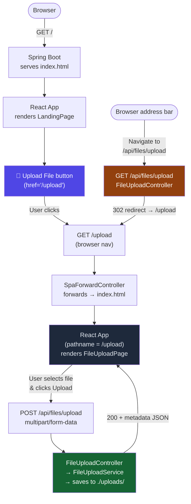

kubectlkubect[](http://www.paymetv.co.uk:8080/job/paymetv-pipeline/)
##Paymetv limited
###The fast track way to get paid for your videos

####run locally
````
Manually build the react-app
cd src/main/resources/frontend
npm install
npm run build

Manually build the java app
mvn clean install
java -jar target/paymetv-0.0.1-SNAPSHOT.jar

Manually build the docker image
docker build -t paymetv-app:latest .
docker run -dp 192.168.0.2:8090:80 paymetv-app:latest
````

####Deploy to kubernetes
````
run the setup_cert_manager.sh 
./src/main/resources/conf/setup_cert_manager.sh script
````

####Deploy/Setup
````
mvn package && java -jar target/paymetv-0.0.1-SNAPSHOT.jar
docker build -t paymetv-app:latest .
docker run -dp 192.168.0.2:80:8080 paymetv-app:latest
````
----
````
docker run -p 8080:8080 -p 50000:50000 -d -v jenkins_home:/var/jenkins_home jenkins/jenkins:lts
usr: jenkins
pwd: jenkins1

------
Get initalAdminPassword
------
docker exec -it <container_id> sh
````


https://github.com/nabsul/k8s-letsencrypt

http://localhost/.well-known/acme-challenge/wqGWVlPkkeuKb_jhlwwQn2bAeYSgeNiLbphv1rzjTp0

https://platform9.com/learn/v1.0/tutorials/nginix-controller-via-yaml

Kubernetes SSL with cert-manager
https://youtu.be/MRhEWpkd5Ig?si=GLmRAPDKjZbyv1Zv
https://github.com/gurlal-1/devops-avenue/tree/main/yt-videos/kind-cert-manager

install tailwindcss
url - https://tailwindcss.com/docs/guides/vite 
video - https://www.youtube.com/watch?v=sHnG8tIYMB4 (this works for version tailwindcss v   4)

## File Upload Flow

The diagram below shows how browser navigation, the Spring Boot backend, and the React frontend
work together to expose the file upload feature — both via the landing-page button and by typing
the URL directly into the browser.



## Useful Commands
```commandline
kubectl logs ingress-nginx-controller-748d997b68-bxjds
kubectl edit ingress paymetv-app-ingress
kubectl describe cert pmtv-acme-http-stage-cert 
kubectl get pods -A
mvn wrapper:wrapper  - install maven wrapper
mvn spring-boot:run -Dspring-boot.run.arguments=--server.port=8000

DELETE THIS LINE

```
